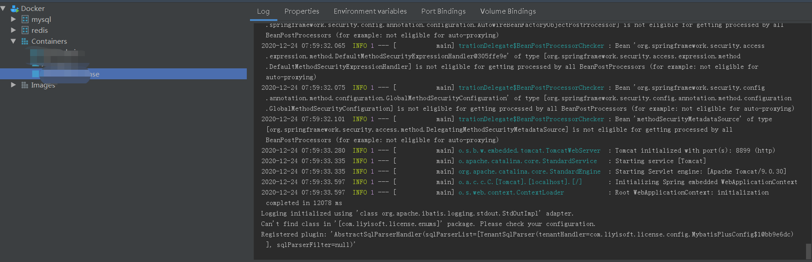

>以下部署均在CentOS上进行测试,默认读者已有Docker相关知识并且测试环境上已经安装Docker

一、修改Docker配置文件以支持远程连接
使用以下命令打开docker的配置文件

```
vim /usr/lib/systemd/system/docker.service
```

在`[Service]`节点将

```
ExecStart=/usr/bin/dockerd -H fd:// --containerd=/run/containerd/containerd.sock
```

替换成

```
ExecStart=/usr/bin/dockerd -H unix:///var/run/docker.sock -H tcp://0.0.0.0:2375
```

二、IDEA 安装Docker插件并进行远程Docker连接配置

当出现connection successful 提示字样.表示前期工作已经完成

三、编写Dockerfile文件

```
FROM java:8
VOLUME /tmp
ADD target/license-1.0.0.jar app.jar
ENTRYPOINT ["java","-jar","/app.jar"]
```

1. FROM java:8 表示镜像依托于java:8基础镜像
2. VOLUME /tmp springboot以jar包的方式启动使用的是Springboot内置的Tomcat,tomcat运行需要tmp临时目录.
3. ADD target/license-1.0.0.jar app.jar 将target目录下的jar包拷贝到容器中,并重命名为app.jar
4. ENTRYPOINT ["java","-jar","/app.jar"] 启用jar命令

四、项目中添加docker-maven-plugin插件
在项目的pom.xml文件中添加以下配置信息

```xml
<plugin>
  <groupId>com.spotify</groupId>
  <artifactId>docker-maven-plugin</artifactId>
  <version>1.2.0</version>
  <!--在执行mvn package命令顺便执行 mvn docker:build 命令 打镜像包-->
  <executions>
      <execution>
          <id>build-image</id>
          <phase>package</phase>
          <goals>
              <goal>build</goal>
          </goals>
      </execution>
  </executions>
  <configuration>
      <!--步骤2绑定的远程服务器的docker地址-->
      <dockerHost>http://xxx.xxx.xxx.xxx:2375</dockerHost>
      <!--author 作者,根据用户实际情况可随意指定-->
      <imageName>author/${project.artifactId}</imageName>
      <imageTags>
          <!--当前镜像的版本-->
          <imageTag>${project.version}</imageTag>
      </imageTags>
      <forceTags>true</forceTags>
      <!--dockerDirectory 表示指定 Dockerfile 的位置-->
      <dockerDirectory>${project.basedir}</dockerDirectory>
      <resources>
          <!--配置jar 所在的位置和名称-->
          <resource>
              <targetPath>/</targetPath>
              <directory>${project.build.directory}</directory>
              <include>${project.build.finalName}.jar</include>
          </resource>
      </resources>
  </configuration>
</plugin>
```

以上配置完成后,执行命令

```
mvn clean package
```

如果一切无误的情况下就会在远程服务器上生成docker镜像,启动镜像



>阿里云用户在测试过程中请确保端口已经加入开放组

五、安全[2021-02-23新增]
不出意外,完成以上配置后,第二天服务器就变成肉鸡了[o(╥﹏╥)o],如何保护我们的Docker,请看参考链接中相关知识[因为尚未实践]

六、参考链接

1. [江南一点雨-一键部署 Spring Boot 到远程 Docker 容器，就是这么秀！](https://juejin.cn/post/6844903927964499975)
2. [Docker 部署SpringBoot项目不香吗？](https://blog.csdn.net/weixin_45132238/article/details/108469150)
3. [Protect the Docker daemon socket](https://docs.docker.com/engine/security/protect-access/)
4. [Docker启用TLS进行安全配置](https://www.cnblogs.com/xiaoqi/p/docker-tls.html)
