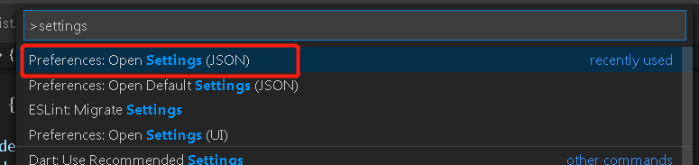

## 配置

1. 快捷键ctrl+shift+p 打开全局搜索框
2. 输入settings,找到settings(JSON)并点击

3. 添加以下配置信息

```json
//ESLint 自定义配置信息
"eslint.alwaysShowStatus": true,
"eslint.quiet": true,
"editor.codeActionsOnSave": {
    "source.fixAll": true,
    "source.fixAll.eslint": true
}
```

如此,eslint在保存的时候会自动修复不符合规范的代码.
